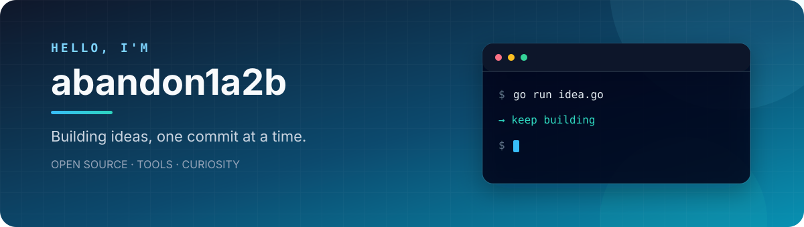

## About me

- 💡 喜欢用代码解决问题，也享受把想法慢慢做成作品
- 🪿 正在维护 [GooseForum](https://github.com/leancodebox/GooseForum)，一个基于 Go 与 Vue 3 的现代论坛系统
- 🌱 保持好奇，持续学习，偶尔折腾一些有趣、实用的小工具

## Tech stack

## Featured projects

| Project | Stack | Description | Stars |
| --- | --- | --- | --- |
| [GooseForum](https://github.com/leancodebox/GooseForum) | Go · Vue 3 | 轻量、现代的社区论坛系统 |  |
| [bigbrother](https://github.com/abandon1a2b/bigbrother) | Go · Fyne | 使用 Go 构建的桌面 GUI 工具 |  |
| [rooster](https://github.com/leancodebox/rooster) | Go | 同时支持定时任务与常驻任务的调度工具 |  |
| [dbhelper](https://github.com/leancodebox/dbhelper) | Go | 数据库辅助工具，可生成 GORM Model |  |
| [kuai](https://github.com/abandon1a2b/kuai) | Go | 简洁实用的 CLI helper |  |

_Keep building, keep learning._

